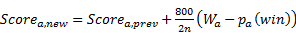
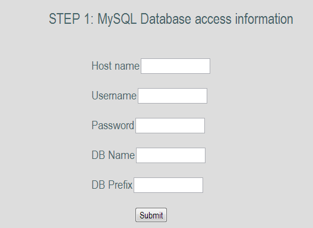
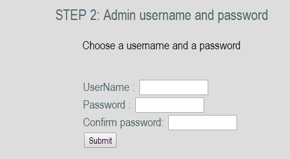
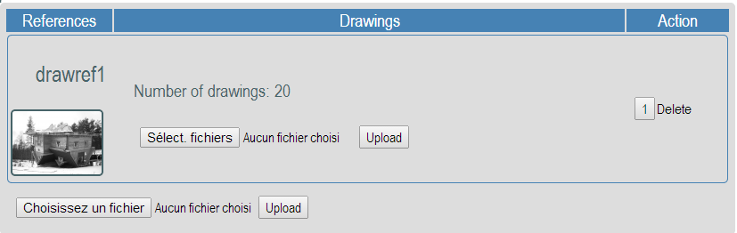
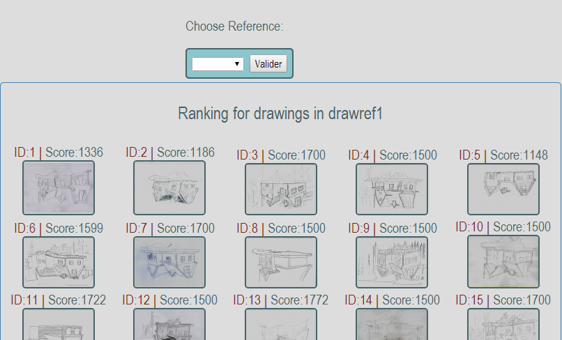
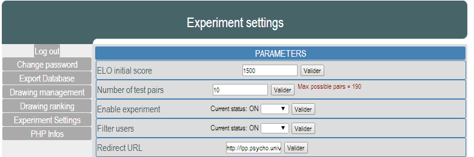
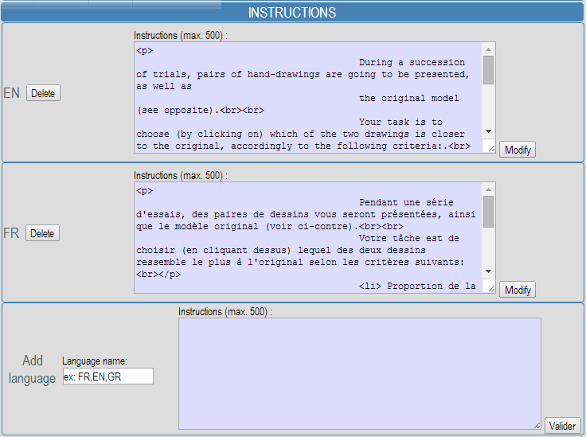

# RankMyDrawings: a web-based tool for assessing drawing accuracy
Version 1.3 | Copyright © 2014 Florian Perdreau

If you wish to use this tool in your research, please cite: 
“Perdreau, F., & Cavanagh, P. (2014). Drawing skill is related to the efficiency of encoding object structure. *i-Perception*, *5*(2), 101–119.”

Summary
=======
1. [License](#license)
2. [Introduction](#introduction)
3. [System Requirements] (#system-requirements)
4. [Installation](#installation)
5. [Sections](#sections)
6. [Registration](#registration-procedure)

License:
=======
Copyright &copy; 2014 Florian Perdreau

*RankMyDrawings* is free software: you can redistribute it and/or modify
it under the terms of the GNU Affero General Public License as published by
the Free Software Foundation, either version 3 of the License, or
(at your option) any later version.

*RankMyDrawings* is distributed in the hope that it will be useful,
but WITHOUT ANY WARRANTY; without even the implied warranty of
MERCHANTABILITY or FITNESS FOR A PARTICULAR PURPOSE.  See the
GNU Affero General Public License for more details.

You should have received a copy of the GNU Affero General Public License
along with RankMyDrawings.  If not, see <http://www.gnu.org/licenses/>.

External sources
----------------
*RankMyDrawings* also depends on several external free softwares:

* PHPMailer, Copyright &copy; 2014 Marcus Bointon, licenced under the [LGPL 2.1 ](http://www.gnu.org/licenses/lgpl-2.1.html "LGPL 2.1").
* html2text, Copyright &copy; 2010 Jevon Wright and others, licenced under the [LGPL 2.1 ](http://www.gnu.org/licenses/lgpl-2.1.html "LGPL 2.1").
* TinyMCE Copyright &copy; Moxiecode Systems AB, licenced under the [LGPL 2.1 ](http://www.gnu.org/licenses/lgpl-2.1.html "LGPL 2.1").

Introduction
===========

RankMyDrawings is a web-based tool designed for helping researchers assessing their participants’ drawing accuracy. It uses an online ELO ranking system (Elo, 1978) that updates drawings’ rank according to their total number of wins against other drawings, the number of times they have been compared as well as their opponents’ current rank.

In addition to the online experiment, an administration interface allows researcher to manage your database (adding reference drawings, adding drawings, export databases in XLS format, modify experimental setting or visualize the current ranking).

Finally, Matlab function is provided. It can automatically export the online database in Excel tables and then import it in Matlab’s workspace.

Experimental Procedure
----------------------

RankMyDrawings allows experimenter to rank drawings corresponding to different drawing tasks (and hence to different original pictures). In that case, during each session, participants will rank drawings corresponding to a same drawing task. A “reference drawing” will be automatically chosen for each participant on the basis of the total number of users in each drawing task.

During each ranking session, a list of random pairs of drawings is generated for each participant. Although random, this pair selection is optimized so that the less compared pairs are selected in priority and without allowing repetitions of pairs. This sensitively decreases the number of comparisons needed in order to have the same number of comparisons for each pair.

During each trial, a pair of drawings is displayed as well as the original. Participants have to click on the drawing they find more accurate (according to the provided instructions).

ELO ranking system
------------------

ELO ranking algorithm has been originally developed to rank players in two-competitor games like chess (Elo, 1978). The algorithm computes a probability of win for each compared item (a vs. b) according to its past results and to the score of the other item in the comparison:

\(p_{a}\left( \text{win} \right) = \frac{1}{1 - 10^{- \frac{\text{diff}}{400}}}\) (1)

where *diff* is the difference between item a and b’s previous ELO scores:

\(\text{diff} = \text{Scor}e_{a,\text{prev}} - \text{Scor}e_{b,\text{prev}}\) (2)

This probability is then used to compute the item a’s new score:

\(\text{Scor}e_{a,\text{new}} = \text{Scor}e_{a,\text{prev}} + \frac{800}{2n}(W_{a} - p_{a}\left( \text{win} \right))\) (3)

where *W* is the item’s outcome for the current comparison, a vs b, (*W* = 1 for a win, 0.5 for a draw, and 0 for a loss) and *n* is the number of previous comparisons for the item. These scores for each item reach a final value across all the comparisons made for that item across all the participants.

System requirements
===================

-   A web server running PHP 5.2 or later

-   MySQLi (5.0 or later)

-   CRON table (on Linux servers) or scheduled tasks (on Microsoft Windows servers) *\*required for email notifications*

-   SMTP server (or a Google Mail account)

Installation
=============

Step 1: Upload files on the server
----------------------------------

### Using GIT

Simply clone the Journal Club Manager repository (https://github.com/Fperdreau/rankmydrawings.git) at the root of your web-server.

### Using FTP

-   Upload the “rankmydrawings” folder to the root of your web-server using a FTP client (e.g. Filezilla).

-   Make sure that you have the writing permissions for all the folders and files (set folders chmod to 0755 and files chmod to 0644).

Step 2: Preparation of the database
-----------------------------------

Go to your SQL database interface (e.g. PhpMyAdmin) and create a new database (if you have the rights, however, ask your admin for the name of the database). That’s it!

Step 3: Online installer
------------------------

In your favorite web-browser, go to the URL: <http://www.mydomain.com/jcm/install.php>.

### Step 1: Database information

Provide your database access information.

***Hostname***: e.g.: sql.mydomain.com

***User name***: your SQL username (the one you may use to access PhPMyAdmin).

***Password***: your SQL password.

***Database name***: the name of the database you have created at the Step 3 of the preparation phase.

***Database prefix***: Choose a prefix that will be used to create tables in your database (e.g.: RMD). Make sure the prefix you choose if not already used by other applications installed on your server.

### Step 2: Administration account

Create an administrator account to manage your website.

***Username***: choose a username.

***Password***: choose a password.

***Confirm your password***: retype the password you have chosen.

At the end of this step, you will be automatically redirected to your administration interface. You may be invited to log in using your administration username and password. Once you are logged in, go to “Drawing management” via the left-side menu.

### Step 3: Drawing management

First of all, you need to upload a “reference drawing” corresponding to the original picture your participants had to copy during the drawing task as well as your participants’ drawings.

1.  Add a reference drawing: click on “choose a file”, select the original picture and then click on upload.

2.  Add participants’ drawings: click on the “select files” button. You may be able to select and upload multiple files at once. However, the number of files that can be uploaded at once may depend on your server settings (size limit vary across servers). If the upload of multiple files fails, try with fewer files. Note that you will be able to upload other drawings in the future. They will be added to the database and will be considered as “new players” in the ELO ranking system.

3.  Repeat steps 1 & 2 to add other reference drawings.

Final step: delete installation files
-------------------------------------

Using your favorite FTP client, delete the “install.php” file that you may find in your website root directory as well as the “install” folder.

Administration interface
========================

Change password
---------------

This section allows you to change your administration password.

Export database
---------------

Export the database tables corresponding to the selected “reference drawing” into XLS files (Microsoft Excel format).

Drawing management
------------------

Here, you can add or delete “reference drawings” as well as their corresponding drawings.

Drawing ranking
---------------

Display the drawings’ ranking corresponding to the selected “reference drawing”.

Experiment settings
-------------------

You can modify the experiment’s settings.

### Parameters

**ELO initial score**: the score that is given to any new “player”. **This setting must be modified before the upload of any drawings!**

**Number of test pairs:** Total number of pair each participant will have to compare. This number cannot be greater than the indicated maximum number of possible pairs that is computed as the number of pairwise combinations without repetition.

\(max(\# pairs) = \frac{!\# drawing}{!(\# drawing - 2)!2}\)

**Enable experiment:** Close or open the experiment. If set to OFF, participants will not be able to access the online experiment.

**Filter users:** Allows (ON) or not (OFF) users to participate more than once in the experiments.

**Redirect URL:** URL to which users will be redirected at the end of the experiment.

### Instructions and consent forms

You can add, modify or delete instructions of the experiment as well as the content of the consent form.
