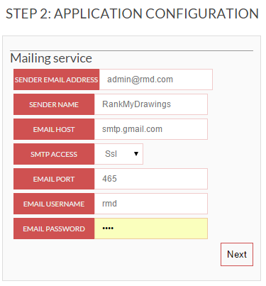
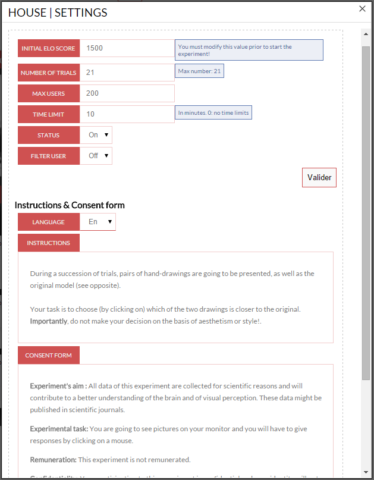
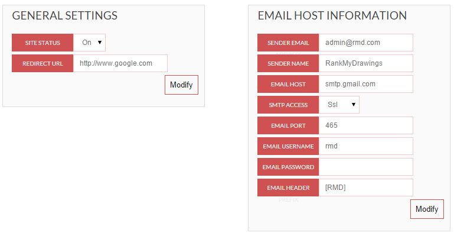
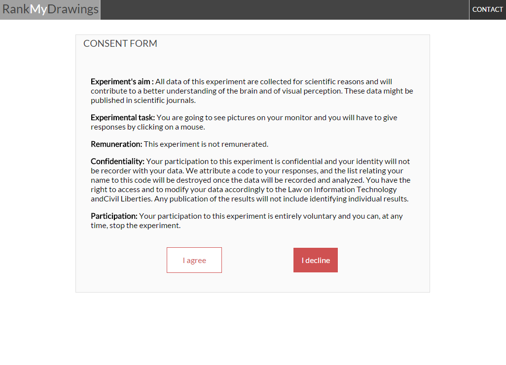
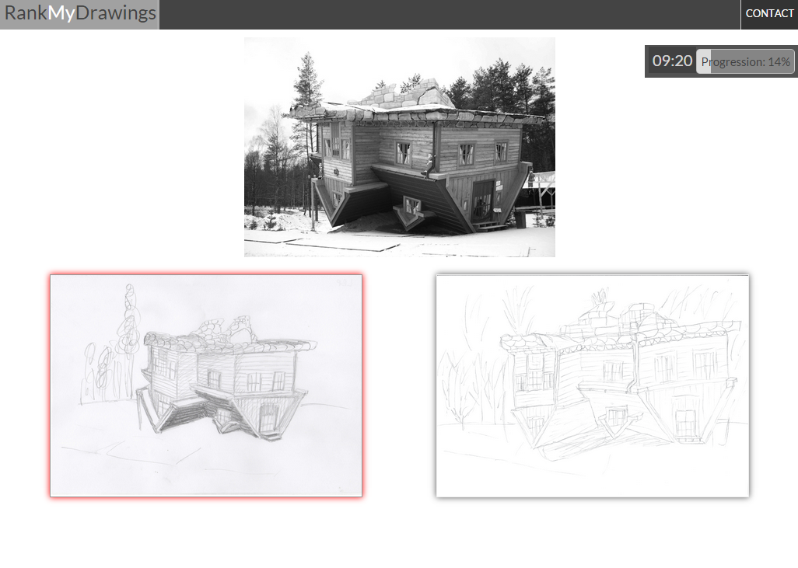

# RankMyDrawings: a web-based tool for assessing drawing accuracy
Version 1.3 | Copyright © 2014 Florian Perdreau

If you wish to use this tool in your research, please cite: 

Perdreau, F., & Cavanagh, P. (2014). Drawing skill is related to the efficiency of encoding object structure. *i-Perception*, *5*(2), 101–119.

Summary
=======
1. [License](#license)
2. [Introduction](#introduction)
3. [System Requirements] (#system-requirements)
4. [Installation](#installation)
6. [Administration Interface](#administration-interface)
5. [Experimental Procedure](#axperimental-procedure)

License:
=======
Copyright &copy; 2014 Florian Perdreau

*RankMyDrawings* is free software: you can redistribute it and/or modify
it under the terms of the GNU Affero General Public License as published by
the Free Software Foundation, either version 3 of the License, or
(at your option) any later version.

*RankMyDrawings* is distributed in the hope that it will be useful,
but WITHOUT ANY WARRANTY; without even the implied warranty of
MERCHANTABILITY or FITNESS FOR A PARTICULAR PURPOSE.  See the
GNU Affero General Public License for more details.

You should have received a copy of the GNU Affero General Public License
along with RankMyDrawings.  If not, see <http://www.gnu.org/licenses/>.

External sources
----------------
*RankMyDrawings* also depends on several external free softwares:

* PHPMailer, Copyright &copy; 2014 Marcus Bointon, licenced under the [LGPL 2.1 ](http://www.gnu.org/licenses/lgpl-2.1.html "LGPL 2.1").
* html2text, Copyright &copy; 2010 Jevon Wright and others, licenced under the [LGPL 2.1 ](http://www.gnu.org/licenses/lgpl-2.1.html "LGPL 2.1").
* TinyMCE Copyright &copy; Moxiecode Systems AB, licenced under the [LGPL 2.1 ](http://www.gnu.org/licenses/lgpl-2.1.html "LGPL 2.1").

Introduction
===========

RankMyDrawings is a web-based tool designed for helping researchers assessing their participants’ drawing accuracy. It uses an online ELO ranking system (Elo, 1978) that updates drawings’ rank according to their total number of wins against other drawings, the number of times they have been compared as well as their opponents’ current rank.

In addition to the online experiment, an administration interface allows researcher to manage your database (adding reference drawings, adding drawings, export databases in XLS format, modify experimental setting or visualize the current ranking).

Finally, Matlab function is provided. It can automatically export the online database in Excel tables and then import it in Matlab’s workspace.

ELO ranking system
------------------

ELO ranking algorithm has been originally developed to rank players in two-competitor games like chess (Elo, 1978). The algorithm computes a probability of win for each compared item (a vs. b) according to its past results and to the score of the other item in the comparison:

where *diff* is the difference between item a and b’s previous ELO scores:

This probability is then used to compute the item a’s new score:

where *W* is the item’s outcome for the current comparison, a vs b, (*W* = 1 for a win, 0.5 for a draw, and 0 for a loss) and *n* is the number of previous comparisons for the item. These scores for each item reach a final value across all the comparisons made for that item across all the participants.

System requirements
===================

-   A web server running PHP 5.2 or later

-   MySQLi (5.0 or later)

-   CRON table (on Linux servers) or scheduled tasks (on Microsoft Windows servers) *\*required for email notifications*

-   SMTP server (or a Google Mail account)

Installation
=============

Step 1: Upload files on the server
----------------------------------

### Using GIT

Simply clone the RankMyDrawings repository (https://github.com/Fperdreau/rankmydrawings.git) to the root of your web-server.

### Using FTP

-   Upload the “rankmydrawings” folder to the root of your web-server using a FTP client (e.g. FileZilla).

-   Make sure that you have the writing permissions for all the folders and files (set folders chmod to 0755 and files chmod to 0644).

Step 2: Preparation of the database
-----------------------------------

Go to your SQL database interface (e.g. PhpMyAdmin) and create a new database (if you have the rights, however, ask your admin for the name of the database). That’s it!

Step 3: Online installer
------------------------

In your favorite web-browser, go to the URL: <http://www.mydomain.com/RankMyDrawings/install.php>.

### Step 0: New installation or update

The installer will automatically check for the presence of previous installations of the Journal Club Manager.

If no previous installation is found, then you will only have the option to start a new installation. This will create all the required SQL tables, folders and files.

Otherwise, you will also have the option of updating a previous installation. Do not worry, this will not overwrite your preexistent data!

### Step 1: Database information

Provide your database access information.

* Hostname : Your SQL hostname (e.g.: sql.mydomain.com)

* User name : your SQL username (the one you may use to access PHPMyAdmin).

* Password : your SQL password (The same you are using to access PHPMyAdmin).

* Database name : the name of the database you have created at the Step 3 of the preparation phase.

* Database prefix : Choose a prefix that will be used to create tables in your database (e.g.: rmd).

\*Make sure the prefix you choose if not already used by other applications installed on your server.

### Step 2: Email host information

An (optional) feature of *RankMyDrawings* is to allow participants to fill in a form in order to contact the administrator/experimenter by email.

To use this feature, you need to set the mailing system and particularly the SMTP host. You can either choose to use

the SMTP host of your server (if there is) or to use the one of any email provider (GMAIL, OUTLOOK, etc.).

* Send Email address: your journal club email

* Sender Name: Name associated to the email address

* Email host: SMTP host address (e.g. smtp.gmail.com if you are using a GMAIL address).

* SMTP access: Security protocol (SSL/TLS/none).

\**Note that using SSL/TLS requires that SSL PHP extension is installed on your web-server.*

* Email username: your email username

* Email password: your email password.

### Step 3: Administration account

Create an administrator account to manage your website.

* Username: choose a username.

* Password: choose a password.

* Confirm your password: retype the password you have chosen.

At the end of this step, you will be automatically redirected to your administration interface. You may be invited to log in using your administration username and password. Once you are logged in, go to “Drawing management” via the left-side menu.

Now you can go to the "Drawing management" section to upload your first reference drawing!

Final step: delete installation files
-------------------------------------

Using your favorite FTP client, delete the “install.php” file that you may find in your website root directory as well as the “install” folder.

Administration interface
========================

Your administration interface is accessible at <http://www.mydomain.com/RankMyDrawings/admin/>

Drawing management
------------------

First of all, you need to upload a “reference drawing” corresponding to the original picture your participants had to copy during the drawing task as well as your participants’ drawings.

#### Add a reference drawing.

1. Choose a name

2. Drag & drop (or click on the uploader) to upload the reference drawing.

3. Refresh the page to see your new reference drawing

#### Add participants’ drawings: 

click on the “select files” button. You may be able to select and upload multiple files at once. However, 
the number of files that can be uploaded at once may depend on your server settings (size limit vary across servers). 
If the upload of multiple files fails, try with fewer files. Note that you will be able to upload other drawings in the future. 
They will be added to the database and will be considered as “new players” in the ELO ranking system.

Once your drawings have been uploaded, they will appear in the drawing list of the reference drawing. You can then click
them to see their information (current score, etc.).

#### Reference drawing's settings

Accessible by clicking on the settings icon (the gray "wheel" next to the reference drawing's name). 

* ELO initial score: Score given to any new “player”. **This setting must be modified before the upload of any drawings!**

* Number of trials: Number of trials per participant

* Max users: Maximum number of participants for this reference drawing

* Time Limit: Maximum duration of the experiment (0: no time limit)

* Status: Enable of disable the experiment for this reference drawing

* Filter user: Allow or not participants to repeat the experiment

***Instructions and consent***

Here, you can also modify instructions and consent forms (click on the text), as well as add languages (select "add").

Admin info
----------
Here you can modify administrator's username, email address and password.

Tools
---------------

***EXPORT***

Export the selected reference drawing's database into xls files that will be compressed into a ZIP file. 
After the exportation completed, a link to the ZIP file will be displayed.

***Backup Services*** 

Note: these services can be run as scheduled tasks. To do so, plan a schedule task (or a cron task for server running on Linux)
and point it to /some/local/path/RankMyDrawings/cronjobs/run.php. You can set the running time and frequency here.

* DbBackup: back up the full database.

* FullBackup: backup database and all files

Settings
-------------------

**Redirect URL:** URL to which users will be redirected at the end of the experiment.

Experimental Procedure
========================

RankMyDrawings allows experimenter to rank drawings corresponding to different drawing tasks (and hence to different original pictures). In that case, during each session, participants will rank drawings corresponding to a same drawing task. A “reference drawing” will be automatically chosen for each participant on the basis of the total number of users in each drawing task.

During each ranking session, a list of random pairs of drawings is generated for each participant. Although random, this pair selection is optimized so that the less compared pairs are selected in priority and without allowing repetitions of pairs. This sensitively decreases the number of comparisons needed in order to have the same number of comparisons for each pair.

During each trial, a pair of drawings is displayed as well as the original. Participants have to click on the drawing they find more accurate (according to the provided instructions).

## Participant information
First, the participant must provide his/her information

## Constent Form

Second, the participant must accept the consent form in order to start the experiment. Otherwise, he or she is redirected to the home page.

## Instructions

Instructions are displayed and the participant must click on the start button to begin the experiment.

## Experiment

The reference drawing (original) is displayed in the top half of the window and the pair of drawings to compare is shown in the bottom half.

The participant has to click on the drawing that fulfills the criteria given in the instructions.

At the end of the series of trials, the participant will be redirected to the url set in the application's settings.
